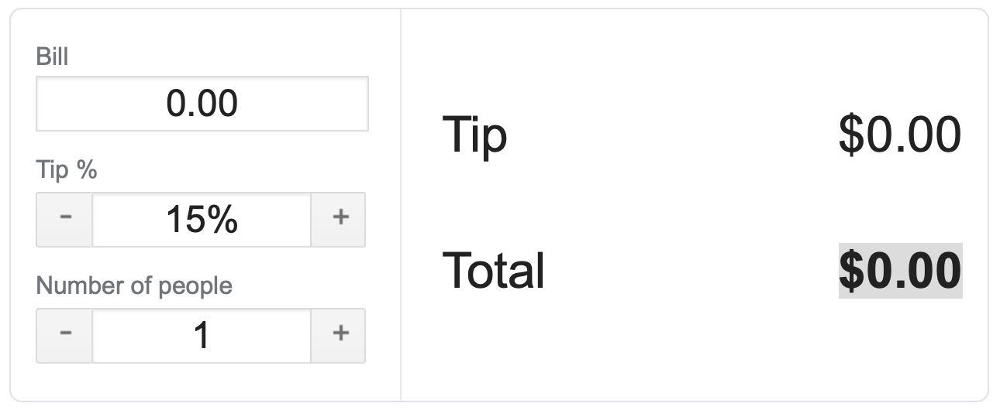

# WEB 1.0 - Tip Calculator

## Description 

This is an introductory assignment for learning JavaScript.

### Why this assignment?

This assignment introduces core concepts used in programming with JavaScript. 

## Project requirements

Your goal is make a tip calculator. Take a look at [this one](https://www.google.com/search?q=tip+calculator&oq=tip):



Play with this, calculate a few tips. What happens? How are the values calculated and displayed? 

**Your goal is write a program that emulates this tip calculator.** You'll need to do the following:

1. Create markup for the calculator, your markup will become the structure and user interface.
1. Create CSS styles that will determine how the user interface is presented and what it looks like
1. Write JavaScript to define the functionality and logic that makes the tip calculator calculate and display tips. 

In order to accomplish this task, I have broken it up into 6 challenges. **Follow the challenges below to build your tip calculator.**

**NOTE:** _You should plan on doing a minimum of 1 Git commit for each challenge!_ This will help you keep track of each milestone, and gives you a way to revert in case you need to!

### Challenge 1

**Create the markup for the tip calculator.**

- Create an HTML file
    - Name this file index.html
    - It should be in the root of your project folder
- Write the base HTML document tags 
- Add tags and HTML markup for calculator elements
    - Bill - element: `<input>`
    - Tip - element: `<input>`
    - Number of people - element: `<input>`
    - Display tip - element: could be `<h1-6>`, `<p>`, `<span>`, `<div>`, or `<output>` you decide!
    - Display total - element: `<h1-6>`, `<p>`, `<span>`, `<div>`, or `<output>` you decide!

### Challenge 2

**You'll need to add attributes to the tags.** 

The inputs should have `type="number"`. 

All of the tags that need to be accessed by your JavaScript code should have an id. Remember all id values should be unique! 

When writing the `id` names you'll be repeating these names in your JS code so it would be a good idea to have a naming convention. Discuss your naming covention with another student. 

Kabob case is a good choice for id names: `kabob-case`. All characters are lowercase and hyphen (-) is used at word breaks. 

- `input-bill`
- `input-tip`
- `input-people`
- `display-tip`
- `display-total`

### Challenge 3

**Add a script tag to the bottom of the body.** This should be below all of the other tags but inside the body element. 

```html
<script>
  // Your code here...
</script>
```

You'll write your code here. 

### Challenge 4

**Define variables for each of the elements.** You'll be creating references to DOM elements and storing them in variables in this step. You should have a naming convention. 

Get the reference to the DOM element using `document.querySelecotr('#id-name')`

Use a naming convention for these variables, as you'll need to keep track of them. Explain your naming convention to another student. 

Use `camelCase` for these variable names. In camelcase names begin with a lower case letter and use upper case letters at word bbreaks. 

```js
const billInput = document.querySelector('#bill')
...
```

- `billInput`
- `tipInput`
- `peopleInput`
- `displayTip`
- `displayTotal`

### Challenge 5

**Add listeners to each of the input fields.** These listeners should listen for the `input` event. A `input` event occurs when data input is detected at an input element. As a user enters text or numbers, as each new character is entered, the handler for this event is executed. 

```JS
billInput.addEventListener('input', function(e) {
  ...
})
```

or 

```JS
billInput.addEventListener('change', handleBill)

function handleBill(e) {

}
```

When an input occurs you'll want to calculate the new tip amount and bill total. To do this you will need to get the values for the following:

- tip percentage
- bill amount
- the number of people

To get the value entered in an input use `input.value`. For example:

```js 
const percent = tipInput.value
```

When you get a value like this from an input it will always be a string, even if the input type is number. JS provides a couple functions that convert strings to numbers: 

- `parseFloat(value)` - for decimal values like the bill
- `parseInt(value)` - for whole numbers like number of people

For example: 

```js 
const const percent = parseInt(tipInput.value)
```

You need to get the bill, tip, and number of people to calculate the tip. Calculate the tip using something like the following: 

```JS 
const tip = bill * percent / 100
const total = bill + tip
```

### Challenge 6

Last, display the tip and the total. You can do this by setting the `innerHTML` of the element. For example: 

```JS
displayTip.innerHTML = tip
```

## More Challenges

If you've got everything else working here are some optional stretch challenges you can try:

1. Get your calculator live on Github Pages. Follow the guide here: https://pages.github.com
1. Style your calculator. Add some CSS to improve the font styles and the layout. 

## More challenging problems 

Here are some more challenging problems: 

1. Add +/- buttons beside the tip % and number of people fields. Notice how these work in the [Google Tip Calculator](https://www.google.com/search?q=tip+calculator&oq=tip).
1. Prevent people from entering non numeric values since this will break the calculator.
1. Make the tip display an input that calculates the tip % from the dollar amount input here.

### Deliverable

Your Completed Tip Calculator should be on GitHub. Submit your GitHub repo to Gradescope!

### Due date

Thurs, Sept 29