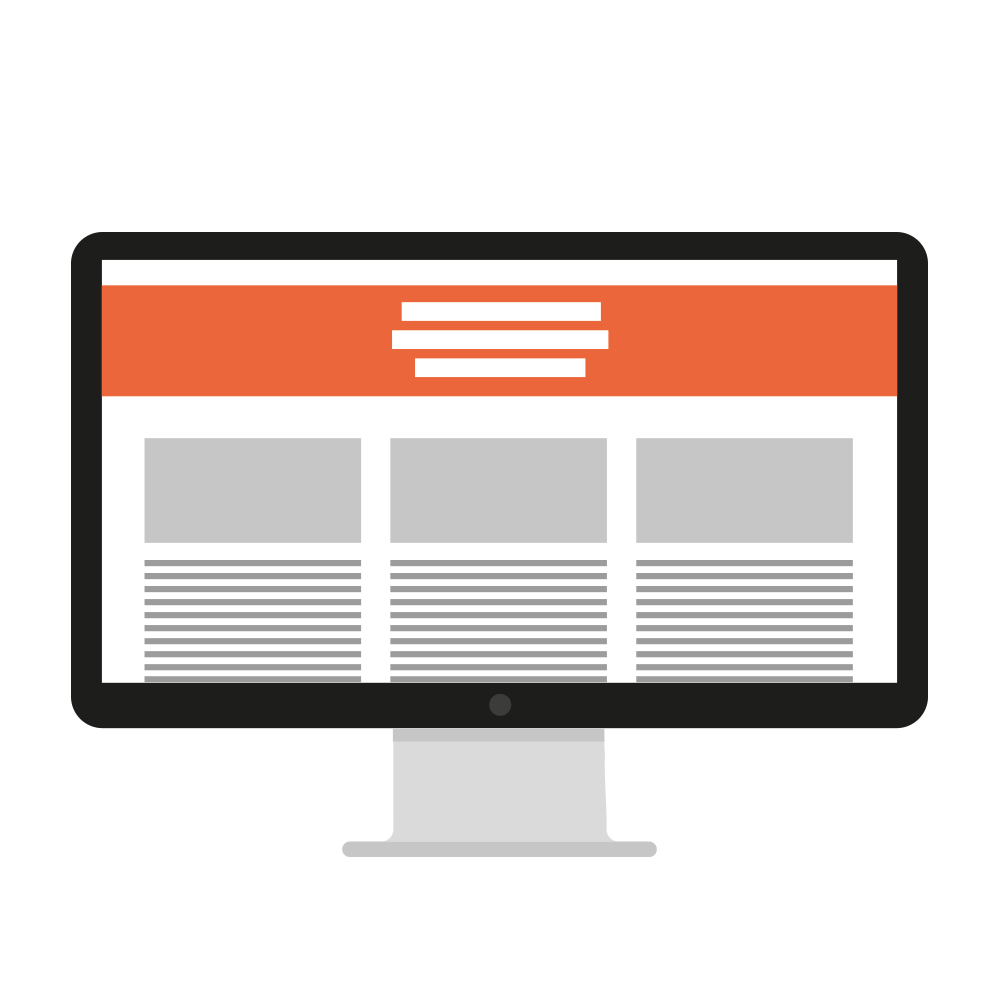
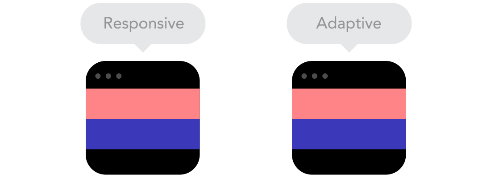

<!-- .slide: data-background="./Images/header.svg" data-background-repeat="none" data-background-size="40% 40%" data-background-position="center 10%" class="header" -->
# FEW 1.1 - Responsive Design

<!-- Put a link to the slides so that students can find them -->

➡️ [**Slides**](/Syllabus-Template/Slides/Lesson1.html ':ignore')

<!-- > -->

## Learning Objectives <!--3 min-->

- Identify the differences between mobile and desktop
- Design for Mobile and Desktop
- Use Media queries to adapt your layouts for mobile

<!-- > -->

### Why Is This Important?

Responsive design is design that responds to it's environment. Giving your sites the ability to adapt to the environement is like giving them a super power!

Consider the following:

1. How often do you view websites on your phone?
1. What if a website wasn’t mobile-friendly? Would they look at it? Would an employer/recruiter?


**Making your website responsive is a requirement if you want to be taken seriously as an engineer.**

<!-- > -->

## What's the difference? <!--5 min-->

What are the differences between mobile and desktop? 

Pair and discuss...

<!-- > -->

### The Differences

- Screen size
- Pixel denisity/size
- Interaction touch vs cursor

Google for screen mobile screen sizes....

What did you find?

<!-- > -->

## Screen Sizes <!--5 min-->

The number of mobile screens is bewildering! Through responsive design, we can readjust grid and fields to the appropriate browser size



<!-- v -->

Responsive design also adjusts to the **direction** of screen on phones and tablets


<!-- v -->

Responsive design also adjusts **flushly**, instead of an ‘adaptive’ design that jumps



<!-- > -->

## Viewport <!--5 min-->

When making a mobile site you the developer can configure the viewport. 

Mobile devices by default assume that a web site is configured for desktop assuming the size of the screen 960px wide. In this case you as a viewer would have to pinch, zoom, and scroll around to view the page. 

<!-- > -->

When making a mobile site configuring the viewport to size of the device is a good idea. 

```html
<meta 
  name='viewport' 
  content='width=device-width, initial-scale=1.0, maximum-scale=1.0' 
/>
```

What does this do? 

<!-- > -->

Sets the viewport options in the browser for this web page. 

- width of the page matches the width of the device
- Initial scale should 100%
- Max scale should be 100%

Result: page renders to the size of the screen and it doesn't scale. 

<!-- > -->

## Testing Mobile <!--5 min-->

There are a couple ways to test your sites on mobile. 

- Emulate a mobile screen in your browser. 
  - Safari: 
    - Turn on developer mode in Safari > Preferences > Advanced Check "Show Develop menu"
  - Chrome: OPen the inspector and click the Mobile icon in the upper left. 
- Publish to GitHub and test on a mobile device.

<!-- > -->

## Media Queries <!--10 min-->

The next step is to apply styles based on the screen size. 

CSS works with a set of **media queries**. These allow you to target styles based the platform or screen size. 

### Video + Discussion

[Watch this video](https://www.youtube.com/watch?v=2KL-z9A56SQ) on media queries to see how to apply them to your projects.

After that, answer these questions on your own, and then discuss your answers with a partner:

1. What are the benefits to using media queries?
1. What are some downfalls to using media queries? 
1. Apple decides to go in a new direction and release a new line of phones next year with non-standard screen sizes. How does this affect your use of media queries?

For more information, take a look at what [the documentation says](https://developer.mozilla.org/en-US/docs/Web/CSS/Media_Queries/Using_media_queries)

<!-- > -->

## Using Media Queries

In a broad sense you can target CSS styles to specific media: print, screen, or speech. 

Use one of two methods: 

<!-- > -->

Target all rules in a stylesheet at a media category. 

`<link rel="stylesheet" href="styles.css" media="print">`

<!-- > -->

In a stylesheet target rules at media: 

```CSS
@media print {
  body {
    color: black;
  }
  ...
}
```

<!-- > -->

## 10 min Break

<!-- > -->

## Break points <!--20 min-->

Targeting different media types like print or screen is easy and the difference is obvious. When targeting phones, tablets, and other computers the differences are harder to identify. 

<!-- > -->

Common practice is to look at the screen size and target screens in categories.

https://www.w3schools.com/howto/howto_css_media_query_breakpoints.asp

The list could be longer: 

https://responsivedesign.is/develop/browser-feature-support/media-queries-for-common-device-breakpoints/

Here is a another short list: 

https://flaviocopes.com/css-breakpoints/

<!-- > -->

Break points in a picture: https://www.freecodecamp.org/news/the-100-correct-way-to-d

<!-- > -->

### Responsive design

When designing a responsive site you'll need think about how elements on the screen will appear on a screen of a different size. 

<!-- > -->

Take a look at these images and ask yourself what changes? 

- https://www.solodev.com/core/fileparse.php/131/urlt/media-queries-blog.jpg
- https://www.webfx.com/blog/wp-content/uploads/2011/03/iStock-612224522.jpg
- https://www.tech-dock.com/wp-content/uploads/2019/01/responsive-website-design.jpg

<!-- > -->

- In some cases nothing changes
- Boxes stretch or shrink
- Images and text change size
- Number of columns change
- Layout chnages

<!-- > -->

### Using Break Points

**Challenge** 

Have a game plan. Use your design document, created in Sketch, XD or Figma redraw your site sized for mobile 320px wide. 

All content should remain, it should only be moved and resized. 

**Stretch**

Make a tablet sized layout 768px wide.

<!-- > -->

Start working on your web site. Add the meta tag to the head of your html document. 

```html
<meta 
  name='viewport' 
  content='width=device-width, initial-scale=1.0, maximum-scale=1.0' 
/>
```

<!-- > -->

Add these media queries to your stylesheet. 

```CSS
/* Extra small devices (phones, 600px and down) */
@media only screen and (max-width: 600px) {

} 

/* Small devices (portrait tablets and large phones, 600px and up) */
@media only screen and (min-width: 600px) {

} 

/* Medium devices (landscape tablets, 768px and up) */
@media only screen and (min-width: 768px) {

} 

/* Large devices (laptops/desktops, 992px and up) */
@media only screen and (min-width: 992px) {

} 

/* Extra large devices (large laptops and desktops, 1200px and up) */
@media only screen and (min-width: 1200px) {

}
```

You may not use all of these. Start with the first media query (extra small screens) and redefine your grid. This will be different for everyone but might look something like: 

```CSS
/* Extra small devices (phones, 600px and down) */
@media only screen and (max-width: 600px) {
  .wrapper {
    grid-template-columns: repeat(4, 1fr);
    grid-template-rows: 100px;
    grid-template-areas:  "h h h h" /* Rearrange the grid*/
                          "r r r r"
                          "s s s s"
                          "m m m m"
                          "g g g g" 
                          "f f f f";
  }
} 
```

<!-- > -->

After getting the layout figured out work yopur way through your document from the "big" things to small things. Decide what styles need to change at each of the break points. 

<!-- > -->

## Resources 

- https://internetingishard.com/html-and-css/responsive-design/
- https://www.w3schools.com/html/html_responsive.asp
- https://www.w3schools.com/howto/howto_css_media_query_breakpoints.asp
- https://www.w3schools.com/css/css_rwd_intro.asp
- https://30lines.com/website-design/responsible-responsive-design-an-overview/
- https://getflywheel.com/layout/css-breakpoints-responsive-design-how-to/
- https://flaviocopes.com/css-breakpoints/