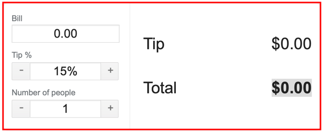
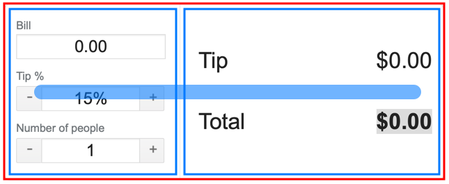

<!-- .slide: data-background="./Images/header.svg" data-background-repeat="none" data-background-size="40% 40%" data-background-position="center 10%" class="header" -->
# FEW 1.1 - Lesson 8 - JS Tip Calculator Part 2

<!-- Put a link to the slides so that students can find them -->

➡️ [**Slides**](/Syllabus-Template/Slides/Lesson1.html ':ignore')

<!-- > -->

## Learning Objectives <!--5 min-->

- Creating design layout with Flexbox
- Using `parseInt()`, `parseFloat()`, and `isNaN()`
- Describe what `NaN` is

<!-- > -->

### Why learn this? 

We're tying two big concepts we've learned so far together in this lesson: styling with Flexbox and utilizing JavaScript. We'll dive a bit deeper into how to deal with various input types using JavaScript, and also what `NaN` is, and how to properly deal with it!

Why do this? We need to make sure our code is handling/expecting the right types, or else we will get errors and the data will get messy!

**Question:** Why do we need to ensure variables are the same type?

<!-- > -->

## Solving problems and the tip calculator <!--3 min-->

The tip calculator presents some programming problems. Think of this as a interview question. 

<!-- > -->

Assumptions: name and list the assumptions? 

<!-- > -->

1. bill: float/number
1. tip: float/int/number
1. people: int/number

<!-- > -->

## Numbers, Strings, and NaN <!--40 min-->

Any value from an `<input>` will be a string even if the value is a number, even if the type  of the input is number.

Use `parseInt(value)` or `parseFloat(value)` to convert a value to a number. 

If the value can not be converted to a number these functions return `NaN`. This a special type that represents something that is "Not a Number". 

```javascript 
const bill = parsFloat(inputBill.value)
const people = parseInt(inputPeople.value)
```

To test if a value is `NaN` use `isNaN(value)`.

```javascript
const badNumber
isNaN('123') // true - Not a number!
isNaN(123)   // false - a Number!
```

<!-- > -->

Let's put that all together into something useful: 

```html
<input id="input-bill">
```

```javascript 
const inputBill = document.getElementById('input-bill')

let bill = 0

inputBill.addEventListener('input', handleBill)

function handleBill(e) {
  const newBill = parseFloat(e.target.value)

  if (!isNaN(newBill)) {
    bill = newBill
  } else {
    e.target.value = bill
  }
}
```

<!-- > -->

### Scope 

It's important to understand that these variables have different scope. As a reminder, Javascript has two scopes: **block** (only accessible within the code block it was declared in) and **function** (only accessible within the function it was declared)

To be the best developer you can be you should always ask the question yourself what the scope is for any variable you happen to be looking at. 

Read [this article on scoping](https://dmitripavlutin.com/javascript-scope/) and answer the following question with a partner:

In your own words, describe the following scopes, and how they all differ:

- block scope
- function scope
- module scope
- global scope
- lexical scope


<!-- v -->

Recall the prior example code:

```html
<input id="input-bill">
```

```javascript 
const inputBill = document.getElementById('input-bill')

let bill = 0

inputBill.addEventListener('input', handleBill)

function handleBill(e) {
  const newBill = parseFloat(e.target.value)

  if (!isNaN(newBill)) {
    bill = newBill
  } else {
    e.target.value = bill
  }
}
```

The sample code above uses the following variables: 

- inputBill
- bill 
- newBill

- **Question:** What is the scope of each variable in the list above? Discuss this with your group.

### Calculating the total and tip

```javascript
function calculateTip() {
  const tip = bill * tipPercent / 100
  const total = bill + tip
  const perPerson = total / people

  displayTip.innerHTML = tip.toFixed(2)
  displayTotal.innerHTML = total.toFixed(2)
  displayEach.innerHTML = perPerson.toFixed(2)
}
```

- Question: what is happening here? discuss this with your group? 
  - What variables are used and what is their scope? 

<!-- > -->

### Event Object

What is `e`? This is an object that describes the event. Handler functions always receive an event objects. 

Event Objects have many properties that are useful. 

<!-- > -->

### event.target

`event.target` is the object where the event originated. In this example it's `<input>`.

Why is the target useful? Allows for DRY code. 

<!-- > -->

## 10 min Break

<!-- > -->

## Styling the Tip Calculator <!--Rest of Class-->

Flexbox is probably the best choice for making the tip calculator. 

Using nested flex parent's allows different levels to be aligned in columns and rows creating a complex layout. 

**Remember: when an element has `display: flex` it's children are arranged using the flex rules.**

Take a look at this image: 

Here is the starting tip calculator.


Here is a wireframe of the tip calculator. Think of each box in the wire frame as one element in the DOM. 


There is an outer container. `main.main`



Use two innner elements to group the left and right side of the tip calculator. The blue line shows the main axis of of the flex container. Here flex direction is row. `div.left-side` and `div.output-container`



The right side section has two children. This right side container can be display flex and have a direction of column. `div.display` `div.display > span`


Inside these two child sections their parent can be display flex with a direction of row and space between. (The code below has three elements here). 


In the left side the container here can be display flex with a direction of column. This arranges the labels and the inputs. `div.right-side`


Each input can be grouped in a parent with it's two button elements. The parent can be flex with direction row. `div.input-container` 


In markup it might look like this: 

```HTML
<main class="main">
  <div class="output left-side">
    <div class="display">Tip:<span id="display-tip"></span></div>
    <div class="display">Total:<span id="display-total"></span></div>
    <div class="display"">Each:<span id="display-each"></span></div>
  </div>

  <div class="input right-side">
    <div class="input-container">
      <span class="label">Bill Amount</span>
      <div class="input-with-buttons">
        <button>-</button>
        <input 
          id="input-bill" 
          value="10"
          type="number">
        <button>+</button>
    </div>

    <div class="input-container">
      <span class="label">Tip %</span>
      <div class="input-with-buttons">
        <button>-</button>
        <input 
          id="input-tip" 
          type="number" 
          name="tip-percent" 
          value="15">
        <button>+</button>
      </div>
    </div>

    <div class="input-container">
      <span class="label">Number of People</span>
      <div class="input-with-buttons">
        <button>-</button>
        <input 
          id="input-people" 
          type="number" 
          value="1">
        <button>+</button>
      </div>
    </div>
  </div>
</main>
```